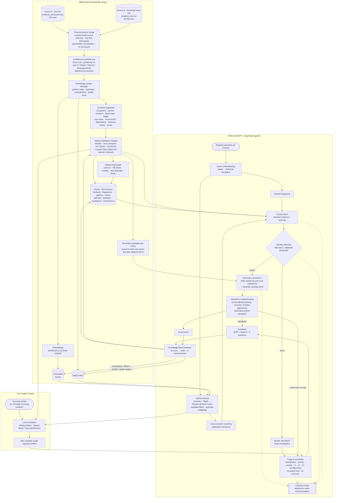
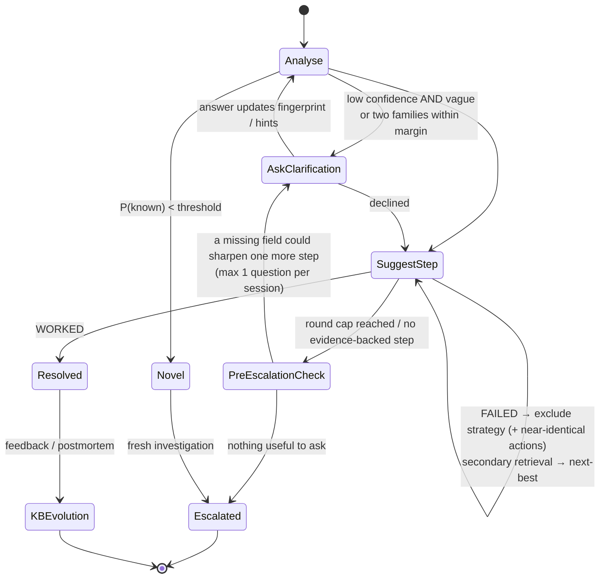
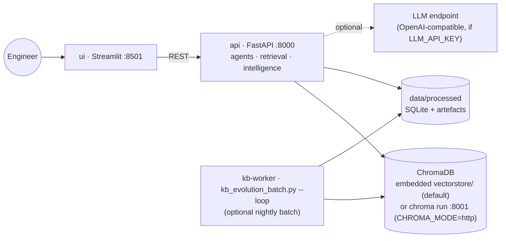

# Architecture

The architecture is expressed as renderable **Mermaid** diagrams (GitHub, GitLab, VS Code and most
Markdown viewers render them). Every box maps to a module; the table under each diagram gives the path.

## 1. End-to-end intelligence flow

| Box | Code |
|---|---|
| Preprocessing & merge | `backend/data_pipeline/{loaders,cleaning,transform,build}.py` |
| Conditioned synthetic text | `backend/data_pipeline/{scenarios,synthetic,llm_verbalizer}.py` |
| Knowledge Quality Manager | `backend/knowledge/quality.py` |
| Enriched fingerprint | `backend/intelligence/fingerprinting.py`, lexicons in `backend/config/lexicon.py` |
| Pattern Intelligence Engine | `backend/intelligence/{pattern_detection,recurrence,causal_chain,builder}.py` |
| Relationship graph | `backend/intelligence/graph.py` |
| Resolution strategies | `backend/rag/strategy.py` |
| Embeddings / ChromaDB / BM25 | `backend/retrieval/{embeddings,vector_store,bm25_index}.py` |
| Query understanding | `backend/retrieval/query_understanding.py` |
| Hybrid retrieval + reranking | `backend/retrieval/{hybrid,reranker}.py` |
| Novelty detection | `backend/intelligence/novelty.py`, threshold fit in `backend/evaluation/calibration.py` |
| Resolution assistance | `backend/rag/{resolution,guardrails,synthesis}.py` |
| Interactive troubleshooting | `backend/troubleshooting/{session,attempts,clarification}.py` |
| Triage & escalation | `backend/services/{triage,escalation}.py` |
| Evidence Chain | `backend/evidence/chain.py` |
| Feedback / KB Evolution / Postmortem | `backend/knowledge/evolution.py`, `backend/services/postmortem.py` |
| Live correlation | `backend/intelligence/correlation.py` |

## 2. Agent graph (LangGraph)

Three agents with **different tool sets**. Every hand-off is an explicit A2A message
(`backend/agents/messages.py`) that the API returns as `agent_messages`.

```mermaid
flowchart LR
    S((START)) --> PA
    subgraph PA["Pattern Intelligence Agent"]
        pa1[hybrid retrieval · read-only]
        pa2[fingerprinter]
        pa3[pattern engine match]
        pa4[causal-chain store]
        pa5[novelty detector]
    end
    subgraph DA["Diagnostic Agent"]
        da1[resolution ranker]
        da2[secondary retrieval<br/>excluding failed strategies]
        da3[attempt tracker · write]
        da4[clarification policy]
        da5[LLM synthesis + validation · optional]
    end
    subgraph EA["Escalation Agent"]
        ea1[triage models]
        ea2[tier router · configurable order]
        ea3[team / expertise router]
        ea4[escalation records · write]
    end
    PA -- "PATTERN_CONTEXT (known)" --> DA
    PA -- "NOVEL_INCIDENT" --> EA
    DA -- "STEP_PROPOSED / CLARIFICATION_ASKED / RESOLVED" --> E((END))
    DA -- "ESCALATE (round cap, no evidence, declined)" --> EA
    EA -- "PACKET_READY" --> E
```

Graphs compiled in `backend/agents/graph.py`: `analyze` (pattern → diagnostic → escalation?),
`session` (diagnostic start → escalation?), `turn` (diagnostic turn → escalation?), `escalate`.

## 3. Troubleshooting loop with clarification before escalation

## 4. Deployment (local processes)

